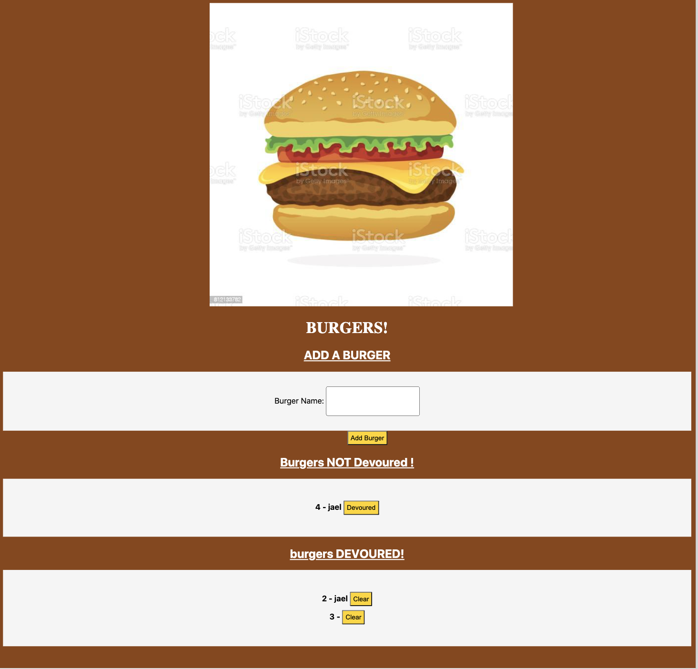

# burger_logger

## Description:

Create a burger logger with MySQL, Node, Express, Handlebars and a homemade ORM (yum!). Be sure to follow the MVC design pattern; use Node and MySQL to query and route data in your app, and Handlebars to generate your HTML

## Burgerapp300:

* Eat-Da-Burger! is a restaurant app that lets users input the names of burgers they'd like to eat.

* Whenever a user submits a burger's name, your app will display the burger on the left side of the page -- waiting to be devoured.

* Each burger in the waiting area also has a `Devour it!` button. When the user clicks it, the burger will move to the right side of the page.

* This app will store every burger in a database, whether devoured or not.

## Tools:
* Visual Studio Code https://code.visualstudio.com.
* Package.json
* Express, express-handlebars, and mysql.

## Images:

 

## LINKS:
### <https://burgerapp300.herokuapp.com/>